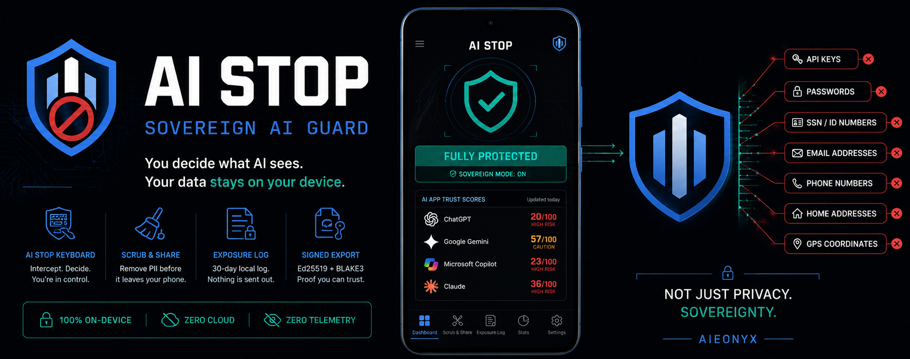

# AI Stop — Sovereign AI Guard

**Copyright (c) 2026 Edison Lepiten / AIEONYX · Apache-2.0**

> **Your device is under surveillance. Most people just don't know it yet.**
>
> Every time you paste into ChatGPT, your words are retained for up to 3 years.
> Every time you open Gemini, human reviewers may read your conversations by default.
> Every time you use DeepSeek, your data is stored in China under PRC law.
> Every time you browse the web, AI crawlers harvest your behavior without consent.
> Every app on your phone is a potential vector for AI data collection.
>
> **You did not agree to become training data. AI Stop makes sure you aren't.**
>
> Built by AIEONYX on sovereign computing principles, AI Stop is the first Android app
> designed to give users real, verifiable control over what AI systems can access.
> It intercepts sensitive data at the clipboard, keyboard, and share sheet level —
> stopping API keys, passwords, health records, SSNs, crypto wallets, and GPS coordinates
> before they ever reach an AI server.
>
> AI Stop does not show you a dashboard of what already happened.
> **AI Stop stops it before it happens.**
>
> No cloud processing. No external servers. No accounts. No subscriptions.
> Every analysis runs on your device. Every decision stays with you.
>
> *This is what digital sovereignty looks like.*

[](https://github.com/aieonyx/aistop/actions)
[](LICENSE)
[](https://developer.android.com)
[](https://github.com/aieonyx/aistop/releases)

---

## What is AI Stop?

AI Stop intercepts what you paste into ChatGPT, Gemini, Copilot, Grok, DeepSeek, and other AI apps — **before it reaches their servers**. Everything runs 100% on your device. No cloud. No telemetry. No subscriptions.

```
┌─────────────────────────────────────────────────────────────┐
│                     YOUR DEVICE                             │
│                                                             │
│  ┌──────────┐    ┌─────────────┐    ┌──────────────────┐   │
│  │ Clipboard │───▶│   AI STOP   │───▶│   AI App         │   │
│  │  / Paste  │    │  INTERCEPT  │    │  (ChatGPT etc.)  │   │
│  └──────────┘    └──────┬──────┘    └──────────────────┘   │
│                         │                                   │
│              ┌──────────▼──────────┐                        │
│              │   PII DETECTION     │                        │
│              │  (Rust core / JNI)  │                        │
│              │                     │                        │
│              │  API keys  ✗        │                        │
│              │  Passwords ✗        │                        │
│              │  SSN / IBAN ✗       │                        │
│              │  GPS coords ✗       │                        │
│              │  PEM / JWT  ✗       │                        │
│              └──────────┬──────────┘                        │
│                         │                                   │
│              ┌──────────▼──────────┐                        │
│              │    EdisonDB         │                        │
│              │  Exposure Log       │                        │
│              │  (On-device only)   │                        │
│              └─────────────────────┘                        │
└─────────────────────────────────────────────────────────────┘
```

---

## Trust Scores — Why AI Apps Score So Low

| AI App     | Score | Risk Level  | Key Issue                          |
|------------|------:|-------------|-------------------------------------|
| DeepSeek   |  15   | 🔴 HIGH RISK | Data stored in China under PRC law  |
| Qwen       |  15   | 🔴 HIGH RISK | Alibaba Cloud, subject to PRC law   |
| Grok       |  21   | 🔴 HIGH RISK | Shared with X Corp, minimal opt-out |
| ChatGPT    |  23   | 🔴 HIGH RISK | Trains on data, opt-out buried      |
| Gemini     |  29   | 🔴 HIGH RISK | 3-year retention, human review on   |
| Copilot    |  33   | 🔴 HIGH RISK | Retention unclear, tied to OpenAI   |
| Grammarly  |  42   | 🟡 CAUTION   | Broad accessibility access          |
| Perplexity |  58   | 🟡 CAUTION   | More transparent than most          |
| Mistral    |  50   | 🟡 CAUTION   | EU-based, GDPR compliant            |
| Claude     |  58   | 🟡 CAUTION   | API excluded from training          |

*Scores based on public privacy policies. Methodology: Data Retention 40% · Transparency 30% · Opt-out Controls 20% · Third-party Sharing 10%*

---

## Three Protection Modes

```
✈ AUTOPILOT          ◉ DEFAULT            ⚙ MANUAL
─────────────        ─────────────        ─────────────
Silent. Total.       Smart balance.       You decide.
Automatic.           High-confidence      Every detection
                     threats blocked.     shows an overlay.
AI Stop blocks       Low-risk items       BLOCK / REDACT /
everything           logged silently.     ALLOW per event.
without asking.
```

---

## Protection Stack

```
┌─────────────────────────────────────────────────┐
│              AI STOP PROTECTION STACK           │
├─────────────────────────────────────────────────┤
│  🛡  SOVEREIGN GUARD                            │
│     Accessibility Service · Auto clipboard scan │
│     Triggers when AI app comes to foreground    │
├─────────────────────────────────────────────────┤
│  ⌨   AI STOP KEYBOARD                          │
│     IME-based · Type-time interception          │
│     Intercepts paste via commitText()           │
├─────────────────────────────────────────────────┤
│  ✂   SCRUBSHARE                                │
│     Share sheet · Any app → AI Stop → Clean    │
│     PII stripped before sharing anywhere        │
├─────────────────────────────────────────────────┤
│  🖼  IMAGE SCRUB                               │
│     EXIF metadata removal                       │
│     GPS · Camera model · Serial · Timestamp     │
└─────────────────────────────────────────────────┘
```

---

## Architecture

```
aistop/
├── aistop-core/              # Rust core (JNI)
│   └── src/
│       ├── pii/              # PII detection engine (regex + BLAKE3)
│       ├── redact.rs         # Token-based redaction
│       ├── scorer.rs         # Trust score computation
│       ├── auditor.rs        # App risk profiling
│       └── store.rs          # EdisonDB storage interface
│
├── app/src/main/
│   ├── kotlin/com/aieonyx/aistop/
│   │   ├── ui/               # Compose screens
│   │   │   ├── theme/        # AiStopColors · AiStopTypography · Theme
│   │   │   ├── MainActivity  # 3-tab nav · dark/light toggle
│   │   │   ├── ProtectScreen # Status bar · mode card · tool cards
│   │   │   ├── AuditScreen   # Trust scores · real app icons
│   │   │   ├── MoreScreen    # Export · PII scanner · sovereign proof
│   │   │   └── OnboardingScreen # 5-screen · mode picker on screen 5
│   │   ├── accessibility/    # SovereignAccessibilityService (mode-aware)
│   │   ├── ime/              # SovereignIME · PasteMediator (mode-aware)
│   │   ├── core/             # TrustDatabase v1.1 · PermissionScanner
│   │   ├── db/               # EdisonDB Android SDK · ExposureDao
│   │   └── jni/              # AiStopCore JNI bridge
│   └── res/
│       ├── font/             # League Spartan · Inter (bundled, no network)
│       └── drawable/         # Onboarding images ob_new_1–5
│
└── store-assets/             # Play Store icon + feature graphic
```

---

## Storage — EdisonDB

AI Stop uses [EdisonDB](https://github.com/aieonyx/edisondb) — a sovereign embedded database replacing Room:

- **ARPi provenance header** (78 bytes) on every write
- **BLAKE3** integrity hash per record
- **Ed25519** signed export
- **GDPR Art.17** erasure via key destruction
- Zero external calls — on-device only

---

## Build

```bash
# Requirements: Rust stable · Android NDK 26.3 · cargo-ndk 3.5.4 · JDK 17

# 1. Build Rust core for Android
cd aistop-core
cargo ndk -t arm64-v8a -t x86_64 \
  -o ../app/src/main/jniLibs build --release

# 2. Run Rust tests
cargo test --no-default-features

# 3. Build debug APK
cd ..
./gradlew assembleDebug \
  -Dorg.gradle.java.home=/usr/lib/jvm/java-17-openjdk-amd64

# 4. Build signed release APK
./gradlew assembleRelease \
  -Dorg.gradle.java.home=/usr/lib/jvm/java-17-openjdk-amd64
```

---

## What's Complete (v1.0.0)

- [x] Rust PII detection engine — 32 tests, 11 PII classes
- [x] Sovereign Guard (Accessibility Service) — mode-aware
- [x] AI Stop Keyboard (IME) — type-time interception
- [x] ScrubShare — share sheet integration
- [x] Image Scrub — EXIF metadata removal
- [x] SovereignMode — AutoPilot / Default / Manual
- [x] EdisonDB Android SDK — replaces Room (M1–M3)
- [x] Exposure log — 30-day local retention, Ed25519 export
- [x] Trust Database v1.1 — 10 AI apps scored
- [x] Real app icons in AUDIT tab
- [x] 5-screen onboarding with mode picker
- [x] Sovereign design system — League Spartan + Inter
- [x] Dark / Light mode toggle
- [x] Tier 1 localization — DE · JA · KO · FR
- [x] Signed release APK — v2 scheme, 17MB
- [x] CI — Rust tests · Android build · Copyright headers
- [x] Privacy policy — aieonyx.github.io/aistop/privacy.html
- [x] Play Store submission — pending Google identity verification

---

## What's Coming

### v1.1 — Deeper Visibility
- [ ] Data flow graph — per-app exposure visualization
- [ ] Live exposure counter on PROTECT screen
- [ ] Export wired — signed JSON download from MORE tab
- [ ] Re-audit button — live rescan
- [ ] Per-app block count in AUDIT tab
- [ ] Tier 2 localization — Filipino · Portuguese · Spanish · Czech
- [ ] Full UI localization (Kotlin strings → string resources)
- [ ] F-Droid submission
- [ ] AIEONYX legal entity registration (jurisdiction TBD)
- [ ] AWP protocol integration (Onyxia browser handoff)

### v2.0 — Sovereign Shield (Network Layer)

> *Because sovereignty is not just about what you paste — it is about everything that leaves your device without your knowledge.*

AI Stop v1.0 protects your intentional input into AI apps.
But the threat goes deeper. Every time you browse the web, open a news app, or scroll social media — trackers, crawlers, and AI training bots are harvesting your behavior, your device fingerprint, your location, and your reading patterns. Silently. Without consent.

**AI Stop v2.0 will close that gap.**
┌─────────────────────────────────────────────────────────────┐
│              AI STOP v2.0 — SOVEREIGN SHIELD                │
├─────────────────────────────────────────────────────────────┤
│                                                             │
│  CURRENT (v1.0)              COMING (v2.0)                  │
│  ─────────────               ───────────────                │
│  ✅ Clipboard intercept      🔲 Local VPN engine            │
│  ✅ IME paste intercept      🔲 DNS-level AI blocking       │
│  ✅ AI app trust scores      🔲 AI crawler blocklist        │
│  ✅ EXIF metadata scrub      🔲 Browser fingerprint guard   │
│  ✅ SovereignMode            🔲 Network data flow map       │
│                              🔲 Real-time exfil detection   │
│                              🔲 Per-app network audit       │
│                              🔲 Sovereign DNS resolver      │
└─────────────────────────────────────────────────────────────┘
**Known AI crawlers that will be blocked:**
`GPTBot · CCBot · Google-Extended · PerplexityBot · Common Crawl`
`Meta AI · Amazonbot · Bytespider · ClaudeBot · cohere-ai`

**Known tracker networks that will be blocked:**
`Meta Pixel · Google Analytics · DoubleClick · AppNexus`
`Branch · Adjust · AppsFlyer · MoEngage · Mixpanel`

**How it works — Local VPN (on-device, no external server):**
Android's `VpnService` API allows a local tunnel that inspects all outbound traffic
without routing it through any external server. Everything stays on your device.
No third-party VPN provider. No logs. No trust required.

- [ ] Local VPN engine (VpnService, on-device only)
- [ ] AI crawler domain blocklist (auto-updated, sovereign)
- [ ] Third-party tracker blocking
- [ ] Browser fingerprint randomisation
- [ ] Real-time network data flow visualisation
- [ ] Per-app network sovereignty score
- [ ] Sovereign DNS resolver (blocks AI harvest domains at DNS level)
- [ ] Notification when any app attempts to contact known AI training endpoints

---

## Sovereign Computing Principles

AI Stop is built on the **S4+i framework**:

```
Security → Sovereignty → Simplicity → Speed → +Intelligence
```

Part of the AIEONYX ecosystem:

| Component  | Role               | Repo                          |
|------------|--------------------|-------------------------------|
| AXONYX     | Sovereign compiler | github.com/aieonyx/AXON       |
| EdisonDB   | Sovereign database | github.com/aieonyx/edisondb   |
| HANIEL     | Rendering engine   | github.com/aieonyx/haniel     |
| Onyxia     | Sovereign browser  | github.com/aieonyx/onyxia     |
| AI Stop    | AI data guard      | github.com/aieonyx/aistop     |

---

---

## Support AIEONYX

AI Stop is a mobile project of **AIEONYX** — a sovereign computing platform.

AIEONYX is building the infrastructure for a world where individuals own their digital identity, their data, and their computing environment. AI Stop is the first consumer product in that mission.

**Every download directly funds:**
- Continued development of AI Stop
- The AXONYX sovereign compiler
- EdisonDB sovereign database
- HANIEL rendering engine
- Onyxia sovereign browser
- The broader AIEONYX open-source ecosystem

### 📲 Download AI Stop on Google Play

> **One-time purchase. No subscription. All future updates included — forever.**

When you download AI Stop, you are not buying a service.
You are funding sovereign open-source computing.

[](https://play.google.com/store/apps/details?id=com.aieonyx.aistop)

---

## Developer

**Edison Lepiten / AIEONYX**
Prague, Czech Republic
[github.com/aieonyx](https://github.com/aieonyx)
[aieonyx.eu@gmail.com](mailto:aieonyx.eu@gmail.com)

*Every purchase funds sovereign open-source computing. Thank you for your support.*
