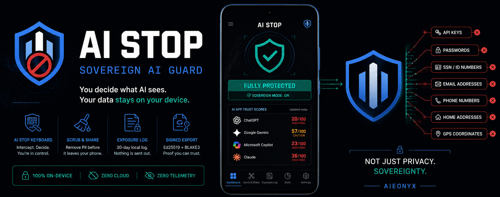
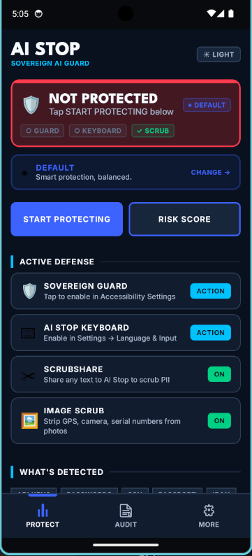
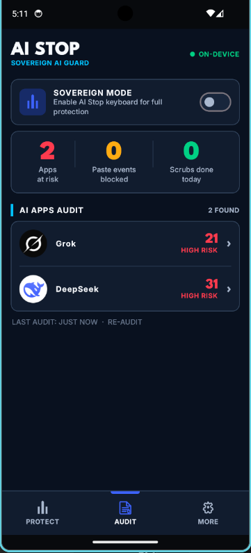
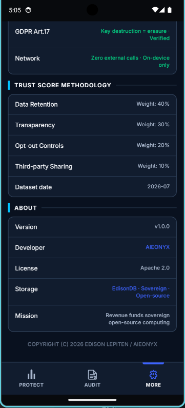
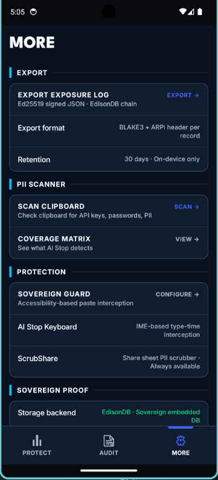

# AI Stop — Sovereign AI Guard

**Copyright (c) 2026 Edison Lepiten / AIEONYX · Apache-2.0**

> **Your device is under surveillance. Most people just don't know it yet.**
>
> Every time you paste into ChatGPT, your words are retained for up to 3 years.
> Every time you open Gemini, human reviewers may read your conversations by default.
> Every time you use DeepSeek, your data is stored in China under PRC law.
> Every time you browse the web, AI crawlers harvest your behavior without consent.
> Every app on your phone is a potential vector for AI data collection.
>
> **You did not agree to become training data. AI Stop makes sure you aren't.**
>
> Built by AIEONYX on sovereign computing principles, AI Stop is the first Android app
> designed to give users real, verifiable control over what AI systems can access.
> It intercepts sensitive data at the clipboard, keyboard, share sheet, and network level —
> stopping API keys, passwords, health records, SSNs, crypto wallets, GPS coordinates,
> and AI crawler DNS queries before they ever reach an AI server.
>
> AI Stop does not show you a dashboard of what already happened.
> **AI Stop stops it before it happens.**
>
> No cloud processing. No external servers. No accounts. No subscriptions.
> Every analysis runs on your device. Every decision stays with you.
>
> *This is what digital sovereignty looks like.*

[](https://github.com/aieonyx/aistop/actions)
[](LICENSE)
[](https://developer.android.com)
[](https://github.com/aieonyx/aistop/releases)

---

## Screenshots

<p align="center">
  
  &nbsp;
  
  &nbsp;
  
  &nbsp;
  
  &nbsp;
  
</p>

<p align="center">
  <em>PROTECT · AUDIT · SHIELD · MORE · Unblock Timer</em>
</p>

---

## What is AI Stop?

AI Stop intercepts what you paste into ChatGPT, Gemini, Copilot, Grok, DeepSeek, and other AI apps — **before it reaches their servers**. In v2.0, it also blocks AI crawlers and trackers at the DNS level, warns you when an AI app bypasses the filter, and lets you cut network access for any app entirely. Everything runs 100% on your device. No cloud. No telemetry. No subscriptions.

```
┌─────────────────────────────────────────────────────────────┐
│                     YOUR DEVICE                             │
│                                                             │
│  ┌──────────┐    ┌─────────────┐    ┌──────────────────┐   │
│  │ Clipboard │───▶│   AI STOP   │───▶│   AI App         │   │
│  │  / Paste  │    │  INTERCEPT  │    │  (ChatGPT etc.)  │   │
│  └──────────┘    └──────┬──────┘    └──────────────────┘   │
│                         │                                   │
│              ┌──────────▼──────────┐                        │
│              │   PII DETECTION     │                        │
│              │  (Rust core / JNI)  │                        │
│              │                     │                        │
│              │  API keys  ✗        │                        │
│              │  Passwords ✗        │                        │
│              │  SSN / IBAN ✗       │                        │
│              │  GPS coords ✗       │                        │
│              │  PEM / JWT  ✗       │                        │
│              └──────────┬──────────┘                        │
│                         │                                   │
│  ┌──────────────────────▼──────────────────────────────┐    │
│  │           SOVEREIGN SHIELD VPN (v2.0)               │    │
│  │                                                     │    │
│  │  DNS query → DnsFilter → BLOCKED? → NXDOMAIN       │    │
│  │                        → ALLOWED? → 8.8.8.8        │    │
│  │                                                     │    │
│  │  100+ AI domains blocked · 0 data leaves device    │    │
│  └─────────────────────────────────────────────────────┘    │
│                                                             │
│              ┌──────────────────────┐                       │
│              │    EdisonDB          │                       │
│              │  Exposure Log        │                       │
│              │  (On-device only)    │                       │
│              └──────────────────────┘                       │
└─────────────────────────────────────────────────────────────┘
```

---

## Trust Scores — Why AI Apps Score So Low

| AI App     | Score | Risk Level  | Key Issue                          |
|------------|------:|-------------|-------------------------------------|
| DeepSeek   |  15   | 🔴 HIGH RISK | Data stored in China under PRC law  |
| Qwen       |  15   | 🔴 HIGH RISK | Alibaba Cloud, subject to PRC law   |
| Grok       |  21   | 🔴 HIGH RISK | Shared with X Corp, minimal opt-out |
| ChatGPT    |  23   | 🔴 HIGH RISK | Trains on data, opt-out buried      |
| Gemini     |  29   | 🔴 HIGH RISK | 3-year retention, human review on   |
| Copilot    |  33   | 🔴 HIGH RISK | Retention unclear, tied to OpenAI   |
| Grammarly  |  42   | 🟡 CAUTION   | Broad accessibility access          |
| Perplexity |  58   | 🟡 CAUTION   | More transparent than most          |
| Mistral    |  50   | 🟡 CAUTION   | EU-based, GDPR compliant            |
| Claude     |  58   | 🟡 CAUTION   | API excluded from training          |

*Scores based on public privacy policies. Methodology: Data Retention 40% · Transparency 30% · Opt-out Controls 20% · Third-party Sharing 10%*

---

## Three Protection Modes

```
✈ AUTOPILOT          ◉ DEFAULT            ⚙ MANUAL
─────────────        ─────────────        ─────────────
Silent. Total.       Smart balance.       You decide.
Automatic.           High-confidence      Every detection
                     threats blocked.     shows an overlay.
AI Stop blocks       Low-risk items       BLOCK / REDACT /
everything           logged silently.     ALLOW per event.
without asking.
```

---

## Protection Stack (v2.0)

```
┌─────────────────────────────────────────────────┐
│              AI STOP PROTECTION STACK           │
├─────────────────────────────────────────────────┤
│  🛡  SOVEREIGN GUARD                            │
│     Accessibility Service · Auto clipboard scan │
│     Triggers when AI app comes to foreground    │
├─────────────────────────────────────────────────┤
│  ⌨   AI STOP KEYBOARD                          │
│     IME-based · Type-time interception          │
│     Intercepts paste via commitText()           │
├─────────────────────────────────────────────────┤
│  🌐  SOVEREIGN SHIELD VPN          ← NEW v2.0  │
│     Local VPN · DNS-level AI blocking           │
│     100+ domains · No external server           │
│     Timed allowlist · App Block List            │
├─────────────────────────────────────────────────┤
│  ⚠   AI APP BYPASS WARNINGS       ← NEW v2.0  │
│     Notifies when app uses hardcoded IPs        │
│     Suppressed if app permanently allowed       │
├─────────────────────────────────────────────────┤
│  ✂   SCRUBSHARE                                │
│     Share sheet · Any app → AI Stop → Clean    │
│     PII stripped before sharing anywhere        │
├─────────────────────────────────────────────────┤
│  🖼  IMAGE SCRUB                               │
│     EXIF metadata removal                       │
│     GPS · Camera model · Serial · Timestamp     │
├─────────────────────────────────────────────────┤
│  👁  CLIPBOARD SENTINEL                        │
│     Always-on clipboard monitoring              │
│     24/7 · Biometric gate to disable            │
└─────────────────────────────────────────────────┘
```

---

## Sovereign Shield — What Gets Blocked

**100+ domains across categories:**

| Category | Examples |
|---|---|
| AI Assistants | openai.com, anthropic.com, gemini.google.com, deepseek.com, perplexity.ai |
| Chinese AI | qwen.aliyun.com, wenxin.baidu.com, zhipuai.cn, minimax.chat, doubao.com |
| AI Media | midjourney.com, suno.ai, pika.art, runwayml.com, lumalabs.ai |
| AI Infrastructure | huggingface.co, commoncrawl.org, laion.ai, scale.com |
| Ad/Tracking | doubleclick.net, google-analytics.com, connect.facebook.net |
| Telemetry | mixpanel.com, segment.io, amplitude.com, sentry.io, hotjar.com |
| AWS AI | sagemaker.amazonaws.com, bedrock.amazonaws.com |
| Azure AI | openai.azure.com, cognitive.microsoft.com |

**Timed Allowlist** — unblock any domain for 2min · 5min · 30min · 1hr · session · permanent. Biometric gate required. Countdown timer shown in SHIELD tab.

**App Block List** — cut network access for any installed app when Shield is ON. Zero extra RAM — handled by Android's VPN kernel framework.

---

## SHIELD Tab — Live Threat Monitor

```
┌─────────────────────────────────────┐
│  SHIELD              ● LIVE         │
│                                     │
│  [47 BLOCKED] [1.2KB] [12 CRAWLERS] │
│                                     │
│  TRAFFIC · LAST 24 MIN              │
│  ████░░░░░░░░░░░░░░░░░░░░░░░░░░░░  │
│                                     │
│  AI THREATS BLOCKED                 │
│  ⛔ openai.com          DNS ×55     │
│  ⛔ telemetry.openai.com TELEMETRY  │
│  ⛔ deepseek.com        DNS ×21     │
│  ⛔ segment.io          TELEMETRY   │
│                                     │
│  ACTIVE FLOWS                       │
│  UDP  8.8.8.8:53           9.4 KB   │
│  ████████░░░░░░░░░░░░░░░░░░░░░░░░  │
└─────────────────────────────────────┘
```

---

## Architecture

```
aistop/
├── aistop-core/              # Rust core (JNI)
│   └── src/
│       ├── pii/              # PII detection engine (regex + BLAKE3)
│       ├── redact.rs         # Token-based redaction
│       ├── scorer.rs         # Trust score computation
│       ├── auditor.rs        # App risk profiling
│       └── store.rs          # EdisonDB storage interface
│
├── app/src/main/
│   ├── kotlin/com/aieonyx/aistop/
│   │   ├── ui/               # Compose screens
│   │   │   ├── theme/        # AiStopColors · AiStopTypography · Theme
│   │   │   ├── MainActivity  # 4-tab nav (PROTECT/AUDIT/SHIELD/MORE)
│   │   │   ├── ProtectScreen # Status · mode · tools · VPN toggle
│   │   │   ├── AuditScreen   # Trust scores · real app icons
│   │   │   ├── ShieldScreen  # Live threat monitor · flow map
│   │   │   ├── MoreScreen    # Export · Shield Monitor · App Block List
│   │   │   ├── UnblockSheet  # Timed allowlist UI · biometric gate
│   │   │   └── AppBlockListScreen # Per-app network block UI
│   │   ├── accessibility/    # SovereignAccessibilityService + AiAppWarning
│   │   ├── ime/              # SovereignIME · PasteMediator
│   │   ├── vpn/              # SovereignVpnService · DnsFilter
│   │   │   ├── BlockedDomains       # 100+ domain blocklist
│   │   │   ├── AllowlistManager     # Timed allowlist
│   │   │   ├── AppBlockList         # Per-app network block
│   │   │   ├── VpnDataBridge        # UI ↔ service data bridge
│   │   │   ├── FlowTracker          # Network flow accumulator
│   │   │   └── AiCreepDetector      # TLS SNI inspection
│   │   ├── core/             # TrustDatabase · PermissionScanner
│   │   ├── db/               # EdisonDB Android SDK · ExposureDao
│   │   └── jni/              # AiStopCore JNI bridge
│   └── res/
│       ├── font/             # League Spartan · Inter (bundled)
│       └── drawable/         # Icons including ic_nav_radar
│
└── store-assets/             # Play Store icon + feature graphic
```

---

## Storage — EdisonDB

AI Stop uses [EdisonDB](https://github.com/aieonyx/edisondb) — a sovereign embedded database:

- **ARPi provenance header** (78 bytes) on every write
- **BLAKE3** integrity hash per record
- **Ed25519** signed export
- **GDPR Art.17** erasure via key destruction
- Zero external calls — on-device only

---

## Build

```bash
# Requirements: Rust stable · Android NDK 26.3 · cargo-ndk 3.5.4 · JDK 17

# 1. Build Rust core for Android
cd aistop-core
cargo ndk -t arm64-v8a -t x86_64 \
  -o ../app/src/main/jniLibs build --release

# 2. Run Rust tests
cargo test --no-default-features

# 3. Build debug APK
cd ..
./gradlew assembleDebug \
  -Dorg.gradle.java.home=/usr/lib/jvm/java-17-openjdk-amd64

# 4. Build signed release bundle
./gradlew bundleRelease \
  -Dorg.gradle.java.home=/usr/lib/jvm/java-17-openjdk-amd64
# Credentials read from local.properties (never commit this file)
```

---

## Changelog

### v2.0.0 — Sovereign Shield (2026-08-01)
- **Sovereign Shield VPN** — local DNS-level AI blocking, no external server
- **100+ blocked domains** — OpenAI, Anthropic, Google AI, DeepSeek, Qwen,
  Baidu, Zhipu, MiniMax, ByteDance, Tencent, iFlytek, Stability, Midjourney,
  Suno, Pika, Luma, HuggingFace, Common Crawl + ad/tracking networks
- **SHIELD tab** — 4th nav tab, live threat monitor, traffic graph, flow map
- **Timed allowlist** — unblock domains for 2min/5min/30min/1hr/session/permanent
- **App Block List** — cut any app's network access when Shield is ON
- **AI app bypass warnings** — notification when VPN-bypassing app opens
- **Unblock sheet** — biometric gate, countdown timer, risk warning
- `versionCode` 4→5, `versionName` 1.1.0→2.0.0

### v1.1.0 — Production Access (2026-07-31)
- Photo AI Scanner (ML Kit OCR + Rust PII)
- Vault export QR code + Ed25519 signed bundle
- Banking Mode card, ExemptDatabase (40+ banking apps)
- Android 15 boot crash fix, SDK 36 compliance

### v1.0.0 — Launch (2026-07)
- Sovereign Guard, AI Stop Keyboard, ScrubShare, Image Scrub
- EdisonDB Android SDK, Sovereign Vault, BiometricGate
- Play Store submission

---

## What's Coming

### v2.1 — Per-App Network Audit
- Per-app AI traffic breakdown in Audit tab
- Block history export (signed bundle)
- DNS blocklist user-editable custom rules
- `AI_MODEL_API` blocking toggle (configurable)

### v2.2 — IP-Range Blocking
- Block AI endpoints even when apps use hardcoded IPs or DoH
- CIDR-level blocking for Google AI, OpenAI, Anthropic, DeepSeek ASN ranges

### v3.0 — AWP Protocol Integration
- `awp://` handoff to Onyxia browser
- EdisonDB cloud-free sync across AIEONYX devices

---

## Sovereign Computing Principles

AI Stop is built on the **S4+i framework**:

```
Security → Sovereignty → Simplicity → Speed → +Intelligence
```

Part of the AIEONYX ecosystem:

| Component  | Role               | Repo                          |
|------------|--------------------|-------------------------------|
| AXONYX     | Sovereign compiler | github.com/aieonyx/AXON       |
| EdisonDB   | Sovereign database | github.com/aieonyx/edisondb   |
| HANIEL     | Rendering engine   | github.com/aieonyx/haniel     |
| Onyxia     | Sovereign browser  | github.com/aieonyx/onyxia     |
| AI Stop    | AI data guard      | github.com/aieonyx/aistop     |
| aiXos      | Sovereign desktop  | github.com/aieonyx/aixos      |

---

## Support AIEONYX

AI Stop is a mobile project of **AIEONYX** — a sovereign computing platform.

**Every download directly funds:**
- Continued development of AI Stop
- The AXONYX sovereign compiler
- EdisonDB sovereign database
- HANIEL rendering engine
- Onyxia sovereign browser
- The broader AIEONYX open-source ecosystem

### 📲 Download AI Stop on Google Play

> **One-time purchase. No subscription. All future updates included — forever.**

[](https://play.google.com/store/apps/details?id=com.aieonyx.aistop)

---

## Developer

**Edison Lepiten / AIEONYX**
Prague, Czech Republic
[github.com/aieonyx](https://github.com/aieonyx)
[aieonyx.eu@gmail.com](mailto:aieonyx.eu@gmail.com)

*Every purchase funds sovereign open-source computing. Thank you for your support.*
